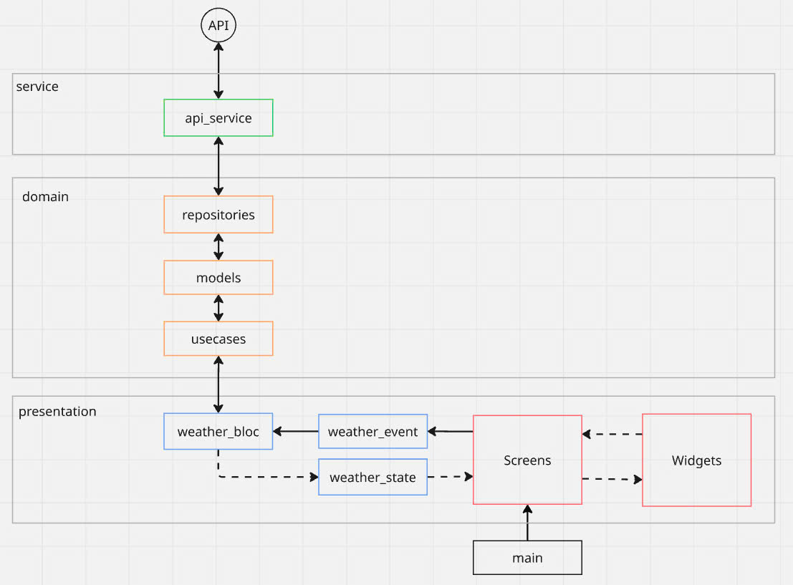

# weather_api_dio

This app uses Dio for handling API requests

It follows a lightweight Architecture: Presentation → Domain → Service layers


# Technologies Used
Flutter

Dio (for API calls)

Bloc (for state management)

JSON Serialization (API response parsing)

# Architecture Diagram


# Demo
[video demo (mp4)](assets/weather_app_demo.mp4)

# Installation

Clone the repository:
```bash
git clone https://github.com/lamhungphan/weather_api_dio.git
```

Install dependencies:
```bash
flutter pub get
```

Run the app:
```bash
flutter run
```

# Notes
The app uses a weather API like OpenWeatherMap or any similar service

Make sure to create an account and obtain a valid API key

It’s recommended to handle network connectivity checks before making API calls